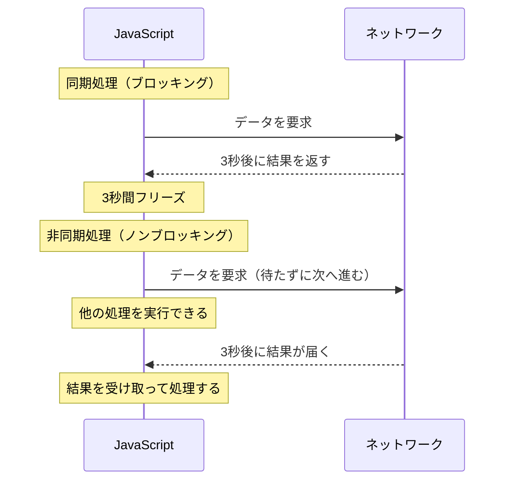
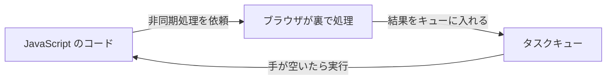
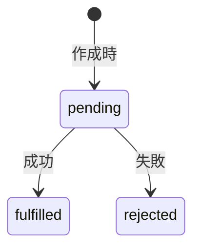

# Promise と async/await — 非同期処理の読み方

## 今日のゴール

- JavaScript がシングルスレッドであること、それが非同期処理を必要とする理由を知る
- Promise が「まだ結果がない」状態を扱うための仕組みであることを知る
- async/await が Promise を同期的に読める構文であることを知る

## JavaScript はシングルスレッドで動く

JavaScript は<strong>シングルスレッド</strong>の言語です。シングルスレッドとは、一度に 1 つの処理しか実行できないということです。料理に例えると、コンロが 1 口しかないキッチンのようなものです。スープを煮ている間は、炒め物に取りかかれません。

Web アプリでは、サーバーからデータを取ってくる処理が頻繁に発生します。この通信には時間がかかります。もし通信が終わるまで JavaScript が何もできなかったらどうなるでしょうか。

```javascript
const response = もしこれが同期的な通信だったら(url);  // 3秒かかる
console.log(response);
```

この 3 秒間、ボタンをクリックしても反応しない。スクロールしても動かない。画面が完全にフリーズします。シングルスレッドなので、通信の待ち時間の間は他の処理を一切実行できないからです。

### 非同期処理という解決策

この問題を解決するのが<strong>非同期処理</strong>です。「時間のかかる処理を待っている間、他の仕事を進める」仕組みです。



同期処理では通信が終わるまで何もできませんが、非同期処理では通信をバックグラウンドに任せて、その間に他の処理を進められます。

::: details イベントループ — 非同期処理を支える仕組み
JavaScript が非同期処理を実現できるのは、<strong>イベントループ</strong>という仕組みがあるからです。

JavaScript 自体はシングルスレッドですが、ブラウザ（や Node.js）がネットワーク通信やタイマーを裏側で処理してくれます。その結果が返ってくると、イベントループが「次に実行すべき処理」としてキューに入れ、JavaScript が手が空いたタイミングで実行します。



深く理解する必要はありません。「JavaScript は 1 つのことしかできないが、時間のかかる仕事はブラウザに任せて、終わったら教えてもらう」という流れだけ覚えておけば十分です。
:::

## コールバックの限界

JavaScript で非同期処理を扱う最も古い方法は<strong>コールバック</strong>です。「この処理が終わったら、この関数を実行してね」と指定する方法です。

```javascript
setTimeout(() => {
  console.log("3秒経ちました");
}, 3000);
```

`setTimeout` は指定した時間が経過したら、渡した関数（コールバック）を実行します。単純な処理ならこれで十分です。

しかし、非同期処理が連続すると問題が起きます。「ユーザー情報を取得して、そのユーザーの注文を取得して、その注文の商品を取得する」という処理を考えてみましょう。

```javascript
fetchUser(userId, (user) => {
  fetchOrders(user.id, (orders) => {
    fetchProduct(orders[0].productId, (product) => {
      console.log(product.name);
    });
  });
});
```

コールバックの中にコールバック、その中にさらにコールバック。ネストが深くなり、読みにくくなります。これが<strong>コールバック地獄</strong>（callback hell）と呼ばれる問題です。

さらに、エラー処理を入れると悲惨なことになります。

```javascript
fetchUser(userId, (user) => {
  if (!user) {
    console.error("ユーザーが見つかりません");
    return;
  }
  fetchOrders(user.id, (orders) => {
    if (!orders) {
      console.error("注文が見つかりません");
      return;
    }
    fetchProduct(orders[0].productId, (product) => {
      if (!product) {
        console.error("商品が見つかりません");
        return;
      }
      console.log(product.name);
    });
  });
});
```

処理の本質は「ユーザー → 注文 → 商品」という直線的な流れなのに、コードは右に右にネストしていきます。この問題を解決するために生まれたのが Promise です。

## Promise — 「まだ結果がない」を包むオブジェクト

<strong>Promise</strong>（プロミス）は、「まだ結果が返ってきていない非同期処理」を 1 つのオブジェクトとして扱う仕組みです。名前の通り「約束」です。「今は結果がないけれど、いずれ結果を届けると約束する」というオブジェクトです。

### 3 つの状態

Promise は常に 3 つの状態のどれかにあります。



| 状態 | 意味 | 例 |
|------|------|-----|
| **pending**（保留中） | まだ結果が出ていない | サーバーに問い合わせ中 |
| **fulfilled**（成功） | 処理が成功して値が手に入った | データが返ってきた |
| **rejected**（失敗） | 処理が失敗してエラーになった | 通信エラーが発生した |

一度 fulfilled か rejected になると、その後は状態が変わりません。成功したものが後から失敗になることはありません。

### `.then()` と `.catch()` でチェーンする

Promise の結果を受け取るには `.then()` を使います。エラーを受け取るには `.catch()` を使います。

```javascript
fetch("https://api.example.com/user/1")
  .then((response) => response.json())
  .then((user) => {
    console.log(user.name);
  })
  .catch((error) => {
    console.error("エラーが発生しました:", error);
  });
```

`fetch` はブラウザに組み込まれた HTTP 通信の関数で、Promise を返します。`.then()` は Promise が fulfilled になったときに実行されます。`.then()` の中で値を返すと、その値を包んだ新しい Promise が返るので、さらに `.then()` を繋げられます。

コールバック地獄だったコードを Promise で書き直してみます。

```javascript
fetchUser(userId)
  .then((user) => fetchOrders(user.id))
  .then((orders) => fetchProduct(orders[0].productId))
  .then((product) => {
    console.log(product.name);
  })
  .catch((error) => {
    console.error("エラー:", error);
  });
```

ネストが解消され、処理の流れが上から下に一直線に読めるようになりました。エラー処理も最後に `.catch()` を 1 つ書くだけで済みます。途中のどの段階でエラーが起きても、`.catch()` で受け取れます。

### コールバック vs Promise

| | コールバック | Promise |
|---|---|---|
| 連続した非同期処理 | ネストが深くなる | `.then()` で平坦に繋がる |
| エラー処理 | 各段階で個別に書く | `.catch()` で一括 |
| 読む方向 | 右に深くなる | 上から下に読める |

## async/await — Promise を同期的に読む構文

Promise のチェーンでコールバック地獄は解消されましたが、`.then()` が続くコードはまだ独特の読みにくさがあります。ここで登場するのが <strong>async/await</strong> です。

`async` と `await` は Promise をより直感的に書くための構文です。処理の中身は Promise とまったく同じですが、「上から下に順番に実行される」ように読めます。

### 基本の使い方

関数の前に `async` をつけると、その関数は必ず Promise を返すようになります。`async` 関数の中では `await` が使えます。`await` は Promise の結果が出るまで待ち、fulfilled の値を取り出します。

```javascript
async function getProductName(userId) {
  const user = await fetchUser(userId);
  const orders = await fetchOrders(user.id);
  const product = await fetchProduct(orders[0].productId);
  console.log(product.name);
}
```

コールバック地獄のコードと見比べてください。やっていることは同じですが、まるで同期処理のように上から下へ読めます。

### `.then()` チェーンとの比較

同じ処理を `.then()` と async/await で書いたものを並べてみます。

```javascript
// .then() チェーン
function getUser() {
  return fetch("https://api.example.com/user/1")
    .then((response) => response.json())
    .then((user) => {
      console.log(user.name);
      return user;
    });
}
```

```javascript
// async/await
async function getUser() {
  const response = await fetch("https://api.example.com/user/1");
  const user = await response.json();
  console.log(user.name);
  return user;
}
```

async/await のほうが、変数に代入しながら順番に処理するという自然な流れになっています。

### エラー処理は try/catch

`.then()` チェーンでは `.catch()` でエラーを受け取りましたが、async/await では JavaScript の標準的な `try/catch` 構文を使います。

```javascript
async function getUser() {
  try {
    const response = await fetch("https://api.example.com/user/1");
    const user = await response.json();
    console.log(user.name);
  } catch (error) {
    console.error("エラーが発生しました:", error);
  }
}
```

`try` ブロックの中でエラーが発生すると、`catch` ブロックに処理が移ります。同期処理のエラーハンドリングとまったく同じ書き方です。

### await は async 関数の中でしか使えない

`await` には 1 つ重要な制約があります。`await` は `async` がついた関数の中でしか使えません。

```javascript
// これはエラーになる
function getUser() {
  const response = await fetch("/api/user");  // SyntaxError
}

// async をつければ OK
async function getUser() {
  const response = await fetch("/api/user");
}
```

::: details トップレベル await
ES2022 以降、モジュール（`<script type="module">` や `.mjs` ファイル）ではファイルの最上位で `await` が使えるようになりました。これを<strong>トップレベル await</strong> と呼びます。

```javascript
// モジュールファイルの最上位
const response = await fetch("/api/config");
const config = await response.json();
```

Next.js の Server Components でもトップレベル await に近い書き方ができますが、これは Next.js がコンポーネント自体を `async` 関数として扱っているためです。
:::

### Promise と async/await の関係

async/await は Promise の「別の書き方」であって、Promise を置き換えるものではありません。

| | Promise（.then()） | async/await |
|---|---|---|
| 仕組み | Promise そのもの | Promise の上に乗った構文 |
| 読みやすさ | チェーンが長いと追いにくい | 上から下に読める |
| エラー処理 | `.catch()` | `try/catch` |
| 使い分け | 短い処理や並列処理 | 直列の処理全般 |

`async` 関数は Promise を返すので、`.then()` で受け取ることもできます。逆に、Promise を返す関数を `await` で待つこともできます。両方を混ぜて使うことは普通にあります。

```javascript
async function getUser() {
  const response = await fetch("/api/user");
  return response.json();
}

// async 関数の戻り値は Promise なので .then() で受け取れる
getUser().then((user) => console.log(user.name));
```

## Next.js での使われ方

Next.js の Server Components（サーバー上で動くコンポーネント）は、`async` 関数として定義できます。コンポーネントの中で直接 `await` を使ってデータを取得するのが、Next.js の基本的なパターンです。

```tsx
export default async function UserPage() {
  const response = await fetch("https://api.example.com/user/1");
  const user = await response.json();

  return (
    <div>
      <h1>{user.name}</h1>
      <p>{user.email}</p>
    </div>
  );
}
```

`fetch` は Promise を返す関数です。`await` で結果を待ち、受け取ったデータを使って JSX を返しています。

従来の React（Client Components）では、コンポーネントの中で直接 `await` を使うことはできませんでした。`useEffect` や `useState` といった仕組みを組み合わせる必要がありました。Server Components の `async/await` が使えることで、データの取得と表示が非常にシンプルになっています。

```tsx
// 複数のデータを取得する例
export default async function DashboardPage() {
  const userResponse = await fetch("https://api.example.com/user/1");
  const user = await userResponse.json();

  const ordersResponse = await fetch(
    `https://api.example.com/users/${user.id}/orders`
  );
  const orders = await ordersResponse.json();

  return (
    <div>
      <h1>{user.name} さんのダッシュボード</h1>
      <h2>注文履歴</h2>
      <ul>
        {orders.map((order) => (
          <li key={order.id}>
            {order.productName} — {order.price}円
          </li>
        ))}
      </ul>
    </div>
  );
}
```

このコードの流れは、先ほど学んだ async/await の使い方そのものです。`fetch` が Promise を返し、`await` で結果を受け取り、上から下へ順番に処理が進みます。

## まとめ

- JavaScript はシングルスレッドで一度に 1 つの処理しか実行できません。通信のような時間のかかる処理で画面が固まるのを防ぐために、非同期処理の仕組みがあります
- コールバックは最も古い非同期処理の書き方ですが、処理が連続するとネストが深くなり読みにくくなります（コールバック地獄）
- Promise は非同期処理の結果を包むオブジェクトです。`.then()` でチェーンすることで、ネストを平坦にできます。状態は pending → fulfilled（成功）/ rejected（失敗）の 3 つです
- async/await は Promise を同期処理のように読める構文です。`async` 関数の中で `await` を使うと、Promise の結果を待ってから次の行に進むように書けます
- Next.js の Server Components は `async` 関数として定義でき、`fetch` の結果を `await` で受け取ってそのまま表示に使えます
